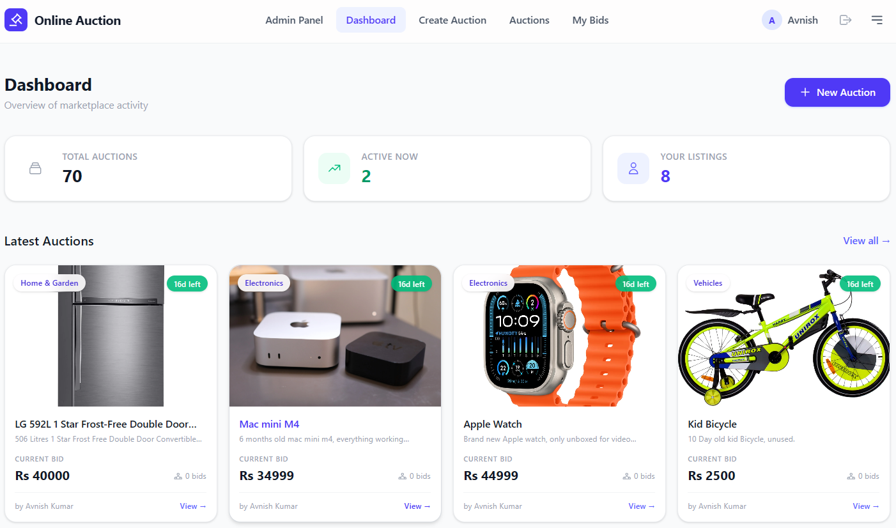

<div align="center">

# Online Auction System

### A production-hardened, real-time auction platform built with the MERN stack

[](https://github.com/mannanj21/online-auction-system/actions/workflows/ci.yml)


**Create auctions · Bid in real-time · Manage everything from an admin panel**

[Report Bug](https://github.com/mannanj21/online-auction-system/issues) · [Request Feature](https://github.com/mannanj21/online-auction-system/issues)

</div>

---

## Screenshots

> Click any image to view full size

<table>
<tr>
<td width="33%" align="center">
<b>Landing Page</b><br><br>
<a href="screenshots/landingpage.png"></a>
</td>
<td width="33%" align="center">
<b>User Dashboard</b><br><br>
<a href="screenshots/dashboard.png"></a>
</td>
<td width="33%" align="center">
<b>Auction Page</b><br><br>
<a href="screenshots/auctionpage.png"></a>
</td>
</tr>
<tr>
<td width="33%" align="center">
<b>Auction Winner</b><br><br>
<a href="screenshots/auctionwinner.png"></a>
</td>
<td width="33%" align="center">
<b>My Bids</b><br><br>
<a href="screenshots/mybids.png"></a>
</td>
<td width="33%" align="center">
<b>Admin Dashboard</b><br><br>
<a href="screenshots/admindashboard.png"></a>
</td>
</tr>
</table>

---

## Why This Project?

Most auction system tutorials stop at basic CRUD. This project goes much further:

- **Provable concurrency safety** — The OCC bidding test demonstrates that exactly 1 bid wins under N simultaneous requests, with consistent DB state. This isn't a claim — it's a passing test.
- **Real-time bidding** — Socket.io rooms with a single atomic service layer prevent race conditions across both REST and WebSocket paths.
- **Production security** — httpOnly cookies, JWT auth, rate-limited auth routes, XSS-safe templates, and input sanitization.
- **Horizontally scalable** — Optional Redis adapter for Socket.io lets multiple server instances share the same pub/sub bus.
- **Deployable today** — Docker + docker-compose, GitHub Actions CI, and a `/health` endpoint for container orchestrators.

> Built as a **Major Project for Computer Science Engineering** by [Mannan Jain](https://github.com/mannanj21).

---

## Features

| Category              | Features                                                                                                                                                                       |
| --------------------- | ------------------------------------------------------------------------------------------------------------------------------------------------------------------------------ |
| **Authentication**    | JWT with httpOnly secure cookies · Auto-login on refresh · Role-based access (User/Admin) · Password change with validation · **Rate-limited to 10 req/15 min per IP**        |
| **Auctions**          | Signed Cloudinary upload · Create via metadata payload · Browse with pagination · Category filtering · Live countdown timers · **Automated winner + email on expiry (5-min cron)** |
| **Real-time Bidding** | Socket.io room-based architecture · **Single shared bid service (REST + WS)** · Atomic bid updates · Live active user count · Instant bid broadcast · Seller cannot self-bid |
| **Dashboard**         | Personal stats (total/active auctions) · Recent auctions grid · Quick navigation                                                                                               |
| **Admin Panel**       | System-wide statistics · User management with search, sort, pagination · Role-based route protection                                                                           |
| **Security**          | Login tracking (IP, geo-location, device, browser) · Login history per user · bcrypt hashing · Env variable validation at startup                                             |
| **Email**             | Contact form with Resend · Dual email (admin + user) · XSS-safe HTML templates · **Automated winner/seller notifications on auction close**                                   |
| **Performance**       | React Query caching · Hover-based data prefetching · View Transitions API animations · gzip compression · Optimized MongoDB indexes                                            |
| **Infrastructure**    | **Docker + docker-compose** · **GitHub Actions CI** · `/health` endpoint · **Redis Socket.io adapter** · Vercel serverless support · Graceful shutdown                         |

---

## Tech Stack

<table>
<tr><td><b>Frontend</b></td><td><b>Backend</b></td><td><b>Infrastructure</b></td></tr>
<tr><td>

React 19 + Vite  
Tailwind CSS v4  
React Router v7  
Redux Toolkit  
TanStack React Query  
Socket.io Client  
React Hot Toast

</td><td>

Node.js + Express 5  
MongoDB + Mongoose  
Socket.io  
JWT + bcrypt  
Cloudinary (signed upload)  
Resend (email)  
express-rate-limit  
node-cron

</td><td>

Docker + docker-compose  
GitHub Actions CI  
Redis (Socket.io adapter)  
Vercel (frontend)  
PM2  
Cloudinary CDN

</td></tr>
</table>

---

## Architecture Decisions

This section explains the non-obvious technical choices made in this project and the reasoning behind each. These are the things worth talking about in a technical interview.

### 1. Optimistic Concurrency Control (OCC) on Bids

**Problem:** Two bidders read the current price simultaneously (e.g., Rs 100), both decide Rs 105 is valid, and both write — one overwrites the other, creating a "lost update."

**Solution:** `findOneAndUpdate` with a `currentPrice` match condition acts as a compare-and-swap:

```js
// Only succeeds if price STILL equals what we read — atomic in MongoDB
Product.findOneAndUpdate(
  { _id: auctionId, currentPrice: product.currentPrice, itemEndDate: { $gt: new Date() } },
  { $set: { currentPrice: amount }, $push: { bids: { bidder: userId, bidAmount: amount } } },
  { new: true }
)
```

If another bid lands between the read and write, `currentPrice` will have changed and the update matches zero documents — returning `null`. The second bidder receives a 409 and is asked to retry.

**Why not a lock?** Locks serialise all bids and kill throughput. OCC lets concurrent reads happen freely and only serialises at the write — correct and fast.

**Proof:** The concurrency test fires N simultaneous bids at the same valid amount using `mongodb-memory-server` (a real mongod binary, not a mock). It asserts:
- Exactly 1 `fulfilled` result
- Exactly N-1 `409` rejections
- Final DB state: `currentPrice === bid amount` and `bids.length === 1`

```
server/tests/bid.concurrency.test.js
```

### 2. Single Shared Bid Service (REST + WebSocket)

**Problem:** The original codebase had two separate, nearly identical bidding code paths — one in `auction.controller.js` for REST calls and one in `auction.handler.js` for Socket.io events. Any bug fix or rule change (e.g., the increment window) had to be applied in two places.

**Solution:** All bid validation and the atomic update live in one place:

```
server/services/bid.service.js  ←  single source of truth
    ↑                                   ↑
auction.controller.js          auction.handler.js
(HTTP → status codes)          (WS → socket.emit errors)
```

`BidError` carries a `statusCode` so both callers translate the same error to their own protocol — the controller returns `res.status(err.statusCode)`, the handler emits `socket.emit("auction:error")`.

### 3. Bid Increment via Environment Variables

The min/max bid increment window (`BID_INCREMENT_MIN`, `BID_INCREMENT_MAX`) is configurable at runtime without a code change. This lets you tune the market mechanics (tight increments for low-value items, wider for high-value) per deployment.

### 4. Proactive Auction Closing (Cron Job)

**Problem:** The original system was purely reactive — auctions were only "closed" (winner set) when someone opened the auction detail page after expiry. An auction with zero post-expiry views would never finalise.

**Solution:** A 5-minute cron job scans for all expired, unsold auctions and:
1. Sets `winner` to the highest bidder
2. Sets `isSold = true`
3. Emails the winner and seller via Resend (email failures are caught independently — a failed email will never prevent the DB commit)

```
server/jobs/closeAuctions.js
```

### 5. Redis Socket.io Adapter (Opt-in Horizontal Scaling)

**Problem:** The in-memory `auctionRooms` Map and Socket.io's default in-process adapter mean a second server instance can't see events from the first. Real-time broadcasts break in a load-balanced multi-instance setup.

**Solution:** If `REDIS_URL` is set, the server attaches `@socket.io/redis-adapter`. All instances share a Redis pub/sub bus and can broadcast to each other's room members.

```
REDIS_URL=redis://redis:6379  →  horizontal scaling enabled
(unset)                        →  single-instance mode (development default)
```

No code changes are needed between modes — it's purely config-driven.

### 6. Auth Rate Limiting

`express-rate-limit` is applied exclusively to `/api/auth/*` routes (login, signup, logout) with a 15-minute window of 10 requests per IP. Verified in-test:

```
Requests 1–10 → 401 (wrong credentials — server processed them)
Requests 11+  → 429 Too Many Requests
```

This limits credential-stuffing and brute-force attacks with zero performance cost on non-auth routes.

---

## Project Structure

```
online-auction-system/
├── .github/
│   └── workflows/
│       └── ci.yml               # Runs server tests + client build on every push/PR
├── client/                      # React frontend
│   ├── Dockerfile               # Multi-stage: build → nginx
│   ├── .dockerignore
│   └── src/
│       ├── components/          # Reusable UI (Navbar, AuctionCard, Footer)
│       ├── pages/               # Route pages (Dashboard, ViewAuction, etc.)
│       ├── hooks/               # React Query hooks + Socket hook
│       ├── services/            # API service layer (Axios)
│       ├── store/               # Redux Toolkit (auth state)
│       ├── layout/              # Layouts (Main, Admin, Open)
│       └── routers/             # Route definitions
├── server/                      # Express backend
│   ├── Dockerfile               # Multi-stage Node image
│   ├── .dockerignore
│   ├── controllers/             # Route handlers (thin — delegate to services)
│   ├── services/
│   │   └── bid.service.js       # ★ Single bid validation + atomic update
│   ├── jobs/
│   │   ├── cleanupUploads.js    # Daily Cloudinary cleanup
│   │   └── closeAuctions.js     # ★ 5-min cron: close expired + notify
│   ├── models/                  # Mongoose schemas (User, Product, Login, Upload)
│   ├── routes/                  # REST API routes
│   ├── socket/
│   │   ├── index.js             # ★ Socket.io init + optional Redis adapter
│   │   └── auction.handler.js   # WS event handlers (delegates to bid.service)
│   ├── middleware/              # Auth middleware
│   ├── utils/                   # JWT, cookies, geo-location
│   ├── config/
│   │   ├── db.config.js
│   │   └── env.config.js        # ★ Validated env vars + BID_INCREMENT_MIN/MAX
│   ├── tests/
│   │   ├── helpers/
│   │   │   ├── db.helper.js     # mongodb-memory-server setup/teardown
│   │   │   └── fixtures.js      # createUser, createAuction factories
│   │   ├── auth.test.js         # Auth route integration tests
│   │   ├── auction.test.js      # Auction route integration tests
│   │   ├── bid.service.test.js  # Bid service unit tests
│   │   └── bid.concurrency.test.js  # ★ OCC proof: N concurrent bids → 1 winner
│   ├── app.js                   # Express app + cron setup
│   └── server.js                # HTTP server + Socket.io + graceful shutdown
└── docker-compose.yml           # ★ server + client + mongo + redis
```

---

## Quick Start

### Option A — Docker (recommended)

```bash
git clone https://github.com/mannanj21/online-auction-system.git
cd online-auction-system

# Copy and fill in your secrets
cp server/.env.example .env

docker-compose up --build
```

- Frontend: **http://localhost:5173**
- Backend: **http://localhost:3000**
- Health check: **http://localhost:3000/health**

### Option B — Local Development

**Prerequisites:** Node.js 20+, MongoDB (local or Atlas), Cloudinary account

```bash
git clone https://github.com/mannanj21/online-auction-system.git
cd online-auction-system

# Install backend
cd server && npm install

# Install frontend
cd ../client && npm install
```

**Server** (`server/.env`):

```env
PORT=3000
ORIGIN=http://localhost:5173
MONGO_URL=mongodb://localhost:27017/auction
JWT_SECRET=your-secret-key-here
JWT_EXPIRES_IN=7d
CLOUDINARY_CLOUD_NAME=your-cloud-name
CLOUDINARY_API_KEY=your-api-key
CLOUDINARY_API_SECRET=your-api-secret
CLOUDINARY_URL=cloudinary://...
RESEND_API_KEY=re_xxxxxxxxxxxx

# Optional: widen or narrow the valid bid window
BID_INCREMENT_MIN=1
BID_INCREMENT_MAX=10

# Optional: enable Redis adapter for horizontal scaling
# REDIS_URL=redis://localhost:6379
```

**Client** (`client/.env`):

```env
VITE_API=http://localhost:3000
VITE_AUCTION_API=http://localhost:3000/auction
```

```bash
# Terminal 1 — Backend
cd server && npm run dev

# Terminal 2 — Frontend
cd client && npm run dev
```

Open **http://localhost:5173** — you're live!

---

## Running Tests

```bash
cd server

# Run all tests (requires mongodb-memory-server to download on first run)
npm test

# Watch mode during development
npm run test:watch
```

Test suite coverage:

| File | What it proves |
|---|---|
| `auth.test.js` | Signup/login/logout happy paths and error cases |
| `auction.test.js` | Create auction, pagination, auto-winner on expiry |
| `bid.service.test.js` | All 6 validation rules: seller, expiry, min, max, not-found, NaN |
| `bid.concurrency.test.js` | **OCC proof**: 10 simultaneous bids → exactly 1 success, 9 conflicts, correct final DB state |

> Tests use `mongodb-memory-server` which spins up a real `mongod` binary — the atomicity guarantees are genuine, not mocked.

---

## API Reference

### Health

| Method | Endpoint  | Auth | Description                             |
|--------|-----------|------|-----------------------------------------|
| `GET`  | `/health` | None | Returns `{ status: "OK", timestamp }`. Used by Docker healthcheck and load balancers. |

### Authentication
> Rate limited: **10 requests per IP per 15 minutes**

| Method | Endpoint       | Description                  |
| ------ | -------------- | ---------------------------- |
| `POST` | `/api/auth/signup` | Register new user        |
| `POST` | `/api/auth/login`  | Login (sets httpOnly cookie) |
| `POST` | `/api/auth/logout` | Logout (clears cookie)   |

### User

| Method  | Endpoint            | Description                | Auth     |
| ------- | ------------------- | -------------------------- | -------- |
| `GET`   | `/api/user`         | Get current user profile   | Required |
| `PATCH` | `/api/user`         | Change password            | Required |
| `GET`   | `/api/user/logins`  | Login history (last 10)    | Required |

### Auctions

| Method | Endpoint                    | Description                                   | Auth     |
| ------ | --------------------------- | --------------------------------------------- | -------- |
| `GET`  | `/api/auction`              | List active auctions (paginated)              | Required |
| `POST` | `/api/auction`              | Create auction (JSON + uploaded image metadata) | Required |
| `GET`  | `/api/auction/stats`        | Dashboard statistics                          | Required |
| `GET`  | `/api/auction/myauction`    | User's own auctions                           | Required |
| `GET`  | `/api/auction/mybids`       | Auctions user has bid on                      | Required |
| `GET`  | `/api/auction/:id`          | Single auction detail                         | Required |
| `POST` | `/api/auction/:id/bid`      | Place a bid                                   | Required |

### Admin

| Method | Endpoint               | Description                        | Auth  |
| ------ | ---------------------- | ---------------------------------- | ----- |
| `GET`  | `/api/admin/dashboard` | Admin statistics                   | Admin |
| `GET`  | `/api/admin/users`     | List users (paginated, searchable) | Admin |

### Upload

| Method | Endpoint                | Description                              | Auth     |
| ------ | ----------------------- | ---------------------------------------- | -------- |
| `GET`  | `/api/upload/signature` | Generate signed Cloudinary upload params | Required |

### Contact

| Method | Endpoint        | Description         | Auth   |
| ------ | --------------- | ------------------- | ------ |
| `POST` | `/api/contact`  | Submit contact form | Public |

---

## Socket.io Events

Authentication is handled via JWT from the cookie on every connection — unauthenticated sockets are rejected before any event handler runs.

| Event                | Direction       | Payload                               |
| -------------------- | --------------- | ------------------------------------- |
| `auction:join`       | Client → Server | `{ auctionId }`                       |
| `auction:leave`      | Client → Server | `{ auctionId }`                       |
| `auction:bid`        | Client → Server | `{ auctionId, bidAmount }`            |
| `auction:userJoined` | Server → Room   | `{ userName, userId, activeUsers[] }` |
| `auction:userLeft`   | Server → Room   | `{ userName, userId, activeUsers[] }` |
| `auction:bidPlaced`  | Server → Room   | `{ auction, bidderName, bidAmount }`  |
| `auction:error`      | Server → Client | `{ message }`                         |

---

## Real-time Bidding Flow

```
┌─────────────────────────────────────────────────────────────────┐
│  Client (ViewAuction page)                                      │
│                                                                 │
│  useSocket hook            REST API (POST /bid)                 │
│  ┌──────────────┐          ┌──────────────┐                     │
│  │ Join Room    │          │ Validate     │                     │
│  │ Listen Bids  │          │ Atomic Update│                     │
│  └──────┬───────┘          └──────┬───────┘                     │
└─────────┼─────────────────────────┼───────────────────────────--┘
          │ WebSocket               │ HTTP
          │                         │
┌─────────┼─────────────────────────┼───────────────────────────--┐
│  Server │                         │                             │
│         ▼                         ▼                             │
│  Socket.io Handler         Express Controller                   │
│  auction:bid        →      POST /api/auction/:id/bid            │
│         │                         │                             │
│         └──────────┬──────────────┘                             │
│                    ▼                                             │
│             bid.service.js (single source of truth)             │
│             • Validate (seller, expiry, min/max)                 │
│             • findOneAndUpdate { currentPrice: snapshot }        │
│               → null? → BidError 409 (stale read)               │
│               → doc?  → return { auction, bidderName }          │
│                    │                                             │
│                    ▼                                             │
│               MongoDB (atomic compare-and-swap)                 │
└─────────────────────────────────────────────────────────────────┘
```

Both REST and WS bids funnel through `bid.service.js`. After a successful bid, the controller/handler broadcasts `auction:bidPlaced` to the Socket.io room so all viewers get live updates.

---

## Deployment

### Docker (Self-hosted)

```bash
# Build and start all services (server, client, mongo, redis)
docker-compose up --build -d

# Check health
curl http://localhost:3000/health
```

Set real secrets via environment variables or a `.env` file at the project root before running.

### Frontend → Vercel

```bash
cd client && npm run build
# Deploy via Vercel CLI or GitHub integration
```

### Backend → AWS EC2 with PM2

The included CI workflow (`ci.yml`) runs tests and build verification on every push and PR to `main`. To add automated EC2 deployment, extend it with SSH deploy steps and add the following GitHub Secrets:

<details>
<summary>Required GitHub Secrets for EC2 deployment</summary>

| Secret                  | Description                  |
| ----------------------- | ---------------------------- |
| `EC2_HOST`              | EC2 public IP                |
| `EC2_USERNAME`          | SSH user (e.g., `ubuntu`)    |
| `EC2_SSH_KEY`           | Private SSH key              |
| `EC2_SSH_PORT`          | SSH port (default: 22)       |
| `EC2_PROJECT_PATH`      | Project directory on EC2     |
| `PORT`                  | Server port                  |
| `ORIGIN`                | Frontend URL for CORS        |
| `MONGO_URL`             | MongoDB connection string    |
| `JWT_SECRET`            | JWT signing secret           |
| `JWT_EXPIRES_IN`        | Token expiry (e.g., `7d`)    |
| `CLOUDINARY_CLOUD_NAME` | Cloudinary cloud name        |
| `CLOUDINARY_API_KEY`    | Cloudinary API key           |
| `CLOUDINARY_API_SECRET` | Cloudinary API secret        |
| `RESEND_API_KEY`        | Resend email API key         |
| `REDIS_URL`             | Redis connection (optional)  |

</details>

---

## Contributing

Contributions are welcome. Any contributions you make are **greatly appreciated**.

1. **Fork** the repository
2. **Create** a feature branch (`git checkout -b feature/amazing-feature`)
3. **Install** dependencies (`cd server && npm i && cd ../client && npm i`)
4. **Make** your changes following existing code style
5. **Add tests** for new behaviour — the concurrency test pattern is a good reference
6. **Commit** using [conventional commits](https://www.conventionalcommits.org/) (`git commit -m "feat: add amazing feature"`)
7. **Push** to your branch (`git push origin feature/amazing-feature`)
8. **Open** a Pull Request — CI must pass before merge

### Ideas for contribution

- **Payment integration** — Stripe/Razorpay for winning bids
- **Push notifications** — Real-time bid alerts via WebPush
- **Advanced search** — Full-text search with filters
- **User ratings** — Buyer/seller reputation system
- **Accessibility** — WCAG compliance improvements

---

## License

Distributed under the **MIT License**. See [LICENSE](LICENSE) for more information.

---

<div align="center">

**Built by [Mannan Jain](https://github.com/mannanj21)**

If this project helped you, consider giving it a ⭐

[⬆ Back to Top](#online-auction-system)

</div>
